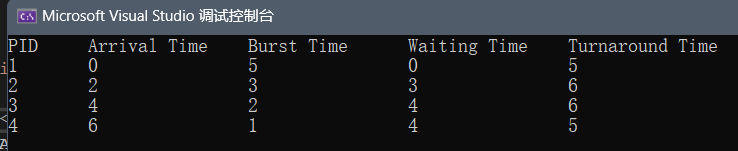
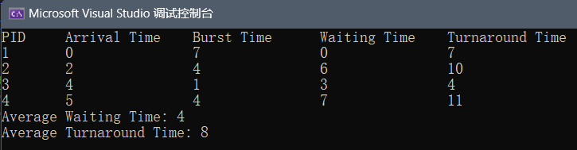
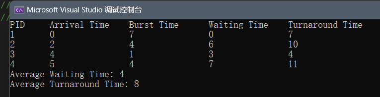
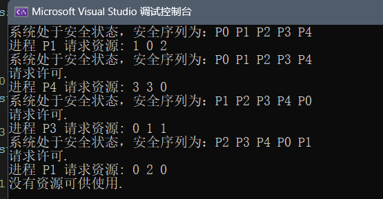
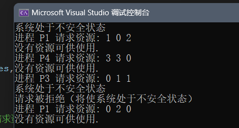

# 实验二：处理机调度

### 一、实验目的

本实验模拟在单处理机情况下的处理机调度，以期加深了解处理机调度算法；同时，本次实验要求编程实现银行家算法，以期加深对避免死锁的理解。

### 二、实验内容

1) 使用 taskmgr.exe 观察实验环境中的进程调度情况；

2) 编程实现一个调度算法，推荐使用 FCFS 算法、SJF 算法、HRN 算法。要求给出对随机测试序列能够给出调度次序；

3) 编程实现银行家算法，要求在给定资源初始状态后能够动态处理进程的资源分配请求；

### 三、思考题

1. FCFS 算法、SJF 算法、HRN 算法的特点是什么？
2. 安全性检查算法的逻辑基础是什么？


## FCFS 算法

- 先按到达时间对进程进行排序。
- 遍历排序后的进程列表，计算每个进程的等待时间和周转时间。
- 等待时间：当前时间 - 到达时间。
- 周转时间：等待时间 + 服务时间。
- 更新当前时间，保证按照先到先服务的顺序进行调度。

```c++
#include <iostream>
#include <vector>
#include <algorithm>

using namespace std;

// 定义一个结构体表示进程
struct Process {
    int pid;         // 进程ID
    int arrivalTime; // 到达时间
    int burstTime;   // 服务时间
    int waitingTime; // 等待时间
    int turnAroundTime; // 周转时间
};

// FCFS 调度算法
void FCFS(vector<Process>& processes) {
    int n = processes.size();
    int currentTime = 0; // 当前时间

    // 按到达时间排序
    sort(processes.begin(), processes.end(), [](Process a, Process b) {
        return a.arrivalTime < b.arrivalTime;
        });

    // 计算每个进程的等待时间和周转时间
    for (int i = 0; i < n; i++) {
        if (currentTime < processes[i].arrivalTime) {
            currentTime = processes[i].arrivalTime; // 如果当前时间小于到达时间，更新当前时间
        }

        processes[i].waitingTime = currentTime - processes[i].arrivalTime; // 等待时间 = 当前时间 - 到达时间
        processes[i].turnAroundTime = processes[i].waitingTime + processes[i].burstTime; // 周转时间 = 等待时间 + 服务时间
        currentTime += processes[i].burstTime; // 当前时间增加服务时间
    }

    // 输出调度顺序和相关信息
    cout << "PID\tArrival Time\tBurst Time\tWaiting Time\tTurnaround Time\n";
    for (const auto& p : processes) {
        cout << p.pid << "\t" << p.arrivalTime << "\t\t" << p.burstTime << "\t\t"
            << p.waitingTime << "\t\t" << p.turnAroundTime << endl;
    }
}

int main() {
    // 生成一个测试进程序列
    vector<Process> processes = {
        {1, 0, 5}, // 进程1，到达时间0，服务时间5
        {2, 2, 3}, // 进程2，到达时间2，服务时间3
        {3, 4, 2}, // 进程3，到达时间4，服务时间2
        {4, 6, 1}  // 进程4，到达时间6，服务时间1
    };

    // 调用FCFS调度算法
    FCFS(processes);

    return 0;
}
```

结果：




## SJF 短作业优先算法

**SJF 调度算法**：

- 在每个时刻选择到达时间不超过当前时间且服务时间最短的进程执行。
- 记录每个进程的等待时间和周转时间，并标记该进程为已完成。
- 如果没有进程可执行，当前时间向前推进。

```c++
#include <iostream>
#include <vector>
#include <algorithm>

using namespace std;

// 进程结构体
struct Process {
    int pid;         // 进程ID
    int arrivalTime; // 到达时间
    int burstTime;   // 服务时间
    int waitingTime; // 等待时间
    int turnAroundTime; // 周转时间
    bool isCompleted;   // 是否已完成
};

// SJF 调度算法（非抢占式）
void SJF(vector<Process>& processes) {
    int n = processes.size();
    int currentTime = 0;    // 当前时间
    int completedProcesses = 0; // 已完成进程数
    int totalWaitingTime = 0;   // 总等待时间
    int totalTurnaroundTime = 0; // 总周转时间

    while (completedProcesses < n) {
        int shortestIndex = -1;
        int shortestTime = INT_MAX;

        // 寻找到达时间 <= 当前时间，且未完成的服务时间最短的进程
        for (int i = 0; i < n; i++) {
            if (processes[i].arrivalTime <= currentTime && !processes[i].isCompleted && processes[i].burstTime < shortestTime) {
                shortestTime = processes[i].burstTime;
                shortestIndex = i;
            }
        }

        // 如果找到合适的进程，进行调度
        if (shortestIndex != -1) {
            currentTime += processes[shortestIndex].burstTime; // 当前时间更新为完成这个进程后的时间
            processes[shortestIndex].waitingTime = currentTime - processes[shortestIndex].arrivalTime - processes[shortestIndex].burstTime;
            processes[shortestIndex].turnAroundTime = processes[shortestIndex].waitingTime + processes[shortestIndex].burstTime;
            processes[shortestIndex].isCompleted = true; // 标记为完成
            completedProcesses++;

            totalWaitingTime += processes[shortestIndex].waitingTime;
            totalTurnaroundTime += processes[shortestIndex].turnAroundTime;
        } else {
            currentTime++; // 如果当前时间没有到达的进程可执行，时间向前推进
        }
    }

    // 输出结果
    cout << "PID\tArrival Time\tBurst Time\tWaiting Time\tTurnaround Time\n";
    for (const auto& p : processes) {
        cout << p.pid << "\t" << p.arrivalTime << "\t\t" << p.burstTime << "\t\t"
             << p.waitingTime << "\t\t" << p.turnAroundTime << endl;
    }

    cout << "Average Waiting Time: " << (double)totalWaitingTime / n << endl;
    cout << "Average Turnaround Time: " << (double)totalTurnaroundTime / n << endl;
}

int main() {
    // 生成测试进程序列
    vector<Process> processes = {
        {1, 0, 7, 0, 0, false}, // 进程1，到达时间0，服务时间7
        {2, 2, 4, 0, 0, false}, // 进程2，到达时间2，服务时间4
        {3, 4, 1, 0, 0, false}, // 进程3，到达时间4，服务时间1
        {4, 5, 4, 0, 0, false}  // 进程4，到达时间5，服务时间4
    };

    // 调用SJF调度算法
    SJF(processes);

    return 0;
}
```




## HRN算法

HRN(Highest Response Ratio Next)** 是一种基于响应比的调度算法。该算法优先调度**响应比**最高的进程。响应比计算公式如下:
$$
响应比= \frac{\text{等待时间} + \text{服务时间}}{\text{服务时间}} = 1 + \frac{\text{等待时间}}{\text{服务时间}}
$$

HRN 算法在一定程度上解决了短作业优先（SJF）中可能出现的**饥饿问题**，因为随着等待时间的增加，响应比也会增加，从而使长时间等待的进程获得优先调度。

```c++
#include <iostream>
#include <vector>
#include <algorithm>

using namespace std;

// 定义进程结构体
struct Process {
    int pid;         // 进程ID
    int arrivalTime; // 到达时间
    int burstTime;   // 服务时间
    int waitingTime; // 等待时间
    int turnAroundTime; // 周转时间
    bool isCompleted;   // 是否完成
};

// HRN 调度算法
void HRN(vector<Process>& processes) {
    int n = processes.size();
    int currentTime = 0;    // 当前时间
    int completedProcesses = 0; // 已完成进程数
    int totalWaitingTime = 0;   // 总等待时间
    int totalTurnaroundTime = 0; // 总周转时间

    while (completedProcesses < n) {
        int highestIndex = -1;
        double highestRatio = -1.0;

        // 寻找响应比最高的进程
        for (int i = 0; i < n; i++) {
            if (processes[i].arrivalTime <= currentTime && !processes[i].isCompleted) {
                // 计算响应比：1 + (等待时间 / 服务时间)
                int waitingTime = currentTime - processes[i].arrivalTime;
                double responseRatio = (waitingTime + processes[i].burstTime) / (double)processes[i].burstTime;

                // 更新响应比最高的进程
                if (responseRatio > highestRatio) {
                    highestRatio = responseRatio;
                    highestIndex = i;
                }
            }
        }

        // 如果找到响应比最高的进程，进行调度
        if (highestIndex != -1) {
            currentTime += processes[highestIndex].burstTime; // 更新当前时间
            processes[highestIndex].waitingTime = currentTime - processes[highestIndex].arrivalTime - processes[highestIndex].burstTime;
            processes[highestIndex].turnAroundTime = processes[highestIndex].waitingTime + processes[highestIndex].burstTime;
            processes[highestIndex].isCompleted = true; // 标记进程为已完成
            completedProcesses++;

            totalWaitingTime += processes[highestIndex].waitingTime;
            totalTurnaroundTime += processes[highestIndex].turnAroundTime;
        } else {
            currentTime++; // 如果没有可调度的进程，当前时间向前推进
        }
    }

    // 输出结果
    cout << "PID\tArrival Time\tBurst Time\tWaiting Time\tTurnaround Time\n";
    for (const auto& p : processes) {
        cout << p.pid << "\t" << p.arrivalTime << "\t\t" << p.burstTime << "\t\t"
             << p.waitingTime << "\t\t" << p.turnAroundTime << endl;
    }

    cout << "Average Waiting Time: " << (double)totalWaitingTime / n << endl;
    cout << "Average Turnaround Time: " << (double)totalTurnaroundTime / n << endl;
}

int main() {
    // 生成测试进程序列
    vector<Process> processes = {
        {1, 0, 7, 0, 0, false}, // 进程1，到达时间0，服务时间7，等待时间0，完成时间0，尚未完成
        {2, 2, 4, 0, 0, false}, // 进程2，到达时间2，服务时间4
        {3, 4, 1, 0, 0, false}, // 进程3，到达时间4，服务时间1
        {4, 5, 4, 0, 0, false}  // 进程4，到达时间5，服务时间4
    };

    // 调用 HRN 调度算法
    HRN(processes);

    return 0;
}
```

结果：




## 银行家算法

银行家算法 是一种避免死锁的资源分配与死锁避免算法。它主要用于系统动态处理资源请求，保证系统在任何时刻都处于一个**安全状态**。如果分配某一进程资源会导致系统进入不安全状态，那么该请求将被拒绝。

核心思想：

1. **安全性检查**：通过判断系统当前是否处于安全状态，来决定是否批准某进程的资源请求。
2. **资源分配请求处理**：在接收到进程的资源请求时，模拟分配，检查是否可以满足请求并保持系统安全。

主要数据结构：

- `Max[i][j]`：进程 `i` 需要的最大资源量。
- `Allocation[i][j]`：进程 `i` 当前已分配的资源量。
- `Need[i][j]`：进程 `i` 还需要的资源量，计算公式：`Need[i][j] = Max[i][j] - Allocation[i][j]`。
- `Available[j]`：当前系统可用的资源量。

数据结构设计：

- **`Max[i][j]`**: 进程 `i` 需要的最大资源量 `j`。
- **`Allocation[i][j]`**: 进程 `i` 当前已经分配的资源量 `j`。
- **`Need[i][j]`**: 进程 `i` 还需要的资源量 `j`，由公式 `Need[i][j] = Max[i][j] - Allocation[i][j]` 计算得出。
- **`Available[j]`**: 当前系统可用的资源量 `j`。
- **`Request[i][j]`**: 进程 `i` 请求的资源量 `j`。

基本步骤：

- **初始化**：定义系统中的资源数量，初始化各进程的最大需求 `Max`，当前已分配的资源 `Allocation`，和系统的可用资源 `Available`。
- **资源请求**：每当有进程发出资源请求时，首先判断其请求是否合理（即 `Request` 不超过 `Need` 和 `Available`），然后尝试分配。
- **安全性检查**：假设资源已经分配，使用安全性检查算法来验证此分配是否会导致系统进入不安全状态。若安全，则批准请求；若不安全，则拒绝请求并回滚分配。

安全性检查算法：

- 创建临时变量 `Work` 和 `Finish` 用于模拟资源分配过程。
- `Work`：表示可用资源，用来判断是否可以满足进程的资源需求。
- `Finish`：记录各进程是否已经完成（即其需求已全部满足）。
- 检查系统能否按照某种顺序满足所有进程的需求，即寻找一个安全序列。如果可以找到一个安全序列，则系统处于安全状态。

```c++
#include <iostream>
#include <vector>

using namespace std;

class BankersAlgorithm {
private:
    int numProcesses, numResources;
    vector<vector<int>> Max;         // 最大需求矩阵
    vector<vector<int>> Allocation;  // 已分配矩阵
    vector<vector<int>> Need;        // 需求矩阵
    vector<int> Available;           // 可用资源向量

public:
    BankersAlgorithm(int processes, int resources, vector<vector<int>> maxMatrix,
        vector<vector<int>> allocMatrix, vector<int> available) {
        numProcesses = processes;
        numResources = resources;
        Max = maxMatrix;
        Allocation = allocMatrix;
        Available = available;
        Need.resize(numProcesses, vector<int>(numResources));
        /*
        初始化二维向量 `Need`，用来存储每个进程对每种资源的需求。
        */

        // 计算每个进程的 Need 矩阵
        for (int i = 0; i < numProcesses; ++i) {
            for (int j = 0; j < numResources; ++j) {
                Need[i][j] = Max[i][j] - Allocation[i][j];
            }
        }
    }

    // 检查系统是否处于安全状态
    bool isSafe() {
        vector<int> work = Available;  // 可用资源副本
        vector<bool> finish(numProcesses, false); // 每个进程是否能完成
        vector<int> safeSequence;      // 存放安全序列

        int completed = 0;  // 完成的进程数

        while (completed < numProcesses) {
            bool found = false;

            for (int i = 0; i < numProcesses; ++i) {
                if (!finish[i]) {
                    bool canAllocate = true;
                    for (int j = 0; j < numResources; ++j) {
                        if (Need[i][j] > work[j]) {
                            canAllocate = false;
                            break;
                        }
                    }

                    if (canAllocate) {
                        for (int j = 0; j < numResources; ++j) {
                            work[j] += Allocation[i][j];
                        }
                        safeSequence.push_back(i);
                        finish[i] = true;
                        found = true;
                        completed++;
                    }
                }
            }

            if (!found) {
                cout << "系统处于不安全状态" << endl;
                return false;
            }
        }

        // 输出安全序列
        cout << "系统处于安全状态，安全序列为：";
        for (int i : safeSequence) {
            cout << "P" << i << " ";
        }
        cout << endl;
        return true;
    }

    // 处理进程的资源请求
    bool requestResources(int processID, vector<int> request) {
        cout << "进程 P" << processID << " 请求资源: ";
        for (int r : request) {
            cout << r << " ";
        }
        cout << endl;

        // 检查请求是否小于 Need 和 Available
        for (int i = 0; i < numResources; ++i) {
            if (request[i] > Need[processID][i]) {
                cout << "请求超过最大需求.\n";
                return false;
            }
            if (request[i] > Available[i]) {
                cout << "没有资源可供使用.\n";
                return false;
            }
        }

        // 尝试分配资源
        for (int i = 0; i < numResources; ++i) {
            Available[i] -= request[i];
            Allocation[processID][i] += request[i];
            Need[processID][i] -= request[i];
        }

        // 检查系统是否安全
        if (isSafe()) {
            cout << "请求许可.\n";
            return true;
        }
        else {
            // 如果不安全，撤销分配
            for (int i = 0; i < numResources; ++i) {
                Available[i] += request[i];
                Allocation[processID][i] -= request[i];
                Need[processID][i] += request[i];
            }
            cout << "请求被拒绝（将使系统处于不安全状态）\n";
            return false;
        }
    }
};

int main() {
    int numProcesses = 5;
    int numResources = 3;

    vector<vector<int>> Max = {
        {7, 5, 3},
        {3, 2, 2},
        {9, 0, 2},
        {2, 2, 2},
        {4, 3, 3}
    };

    vector<vector<int>> Allocation = {
        {0, 1, 0},
        {2, 0, 0},
        {3, 0, 2},
        {2, 1, 1},
        {0, 0, 2}
    };

    vector<int> Available = { 10, 5, 7 };

    BankersAlgorithm ba(numProcesses, numResources, Max, Allocation, Available);

    ba.isSafe();

    vector<int> request1 = { 1, 0, 2 };  // P1 请求资源
    ba.requestResources(1, request1);

    vector<int> request2 = { 3, 3, 0 };  // P4 请求资源
    ba.requestResources(4, request2);

    vector<int> request3 = { 0, 1, 1 };  // P3 请求资源
    ba.requestResources(3, request3);

    vector<int> request4 = { 0, 2, 0 };  // P1 请求资源
    ba.requestResources(1, request4);

    return 0;
}
```

结果：



如果将

`vector<int> Available = { 10, 5, 7 };`

改成：

`vector<int> Available = { 1, 1, 1 };`

得到的结果：




## 思考题

### FCFS 算法

- **特点**：
  - 按照进程到达的顺序进行调度。
  - 不考虑进程的服务时间或优先级。
  - 优点：简单、容易实现，公平（先到的进程先执行）。
  - 缺点：当一个长进程先到时，短进程必须等待较长时间，容易产生"长进程阻塞"问题，可能会导致较长的平均等待时间。
  - 适用场景：适合资源负载不高、进程到达较为均匀的场景。

### SJF 算法：

- **特点**：
  - 优先调度服务时间（执行时间）最短的进程。
  - 非抢占式（即调度后该进程运行到结束）和抢占式（称为 SRTF，Shortest Remaining Time First）。
  - 优点：通常能提供较短的平均等待时间，因为短进程优先执行。
  - 缺点：
    - 需要预知进程的服务时间，这在实际系统中可能比较困难。
    - 可能导致长时间的进程饥饿问题，即长作业可能会长期得不到调度。
  - 适用场景：适用于可以准确预估执行时间的任务，如批处理系统。

### HRN 算法：

- **特点**：
  - 优先调度响应比（Response Ratio）最高的进程
  - 等待时间越长、服务时间越短的进程响应比越高。
  - 优点：通过响应比的计算，避免了 SJF 中的饥饿问题，使得等待时间较长的进程得到优先调度。
  - 缺点：计算过程稍复杂，每次调度时都需要重新计算响应比。
  - 适用场景：适用于需要平衡短作业优先和避免长作业饥饿的系统。


### 安全性检查算法的逻辑基础

安全性检查算法（如银行家算法中的安全性检查）的核心思想是确保系统在进行资源分配时不会导致死锁。它的逻辑基础是通过模拟资源分配过程，确保系统总是能够在一定条件下满足所有进程的最大需求，并最终完成所有进程。安全性检查的主要逻辑基础包括：

1. **可用资源的计算**：
   - 系统当前拥有的可用资源向量 `Available` 是未被任何进程占用的资源总量。

2. **需要的资源与可满足性**：
   - 每个进程的 `Need` 向量表示它还需要多少资源才能完成执行，定义为 `Need[i] = Max[i] - Allocation[i]`。
   - 若某个进程的 `Need` 小于或等于当前可用资源 `Available`，那么该进程的需求是可满足的，可以假设分配这些资源给该进程。

3. **安全状态的定义**：
   - **安全状态**：在假设某些进程被执行并释放资源后，系统依然可以满足其他所有进程的需求。即系统能够按某种顺序调度所有进程，不会出现资源不足的情况。
   - 通过模拟分配资源给进程，更新可用资源，并检查系统是否能够满足后续的所有进程需求。

4. **死锁避免的保障**：
   - 只有当某进程的资源请求不会让系统进入不安全状态时，系统才会批准该请求。
   - 如果分配资源会导致不安全状态，则该请求会被拒绝，避免进入死锁状态。


（以上代码是chatgpt生成的，我觉得这个代码还比较好理解，注释也都很清楚。）