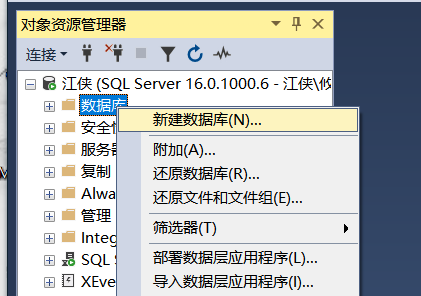
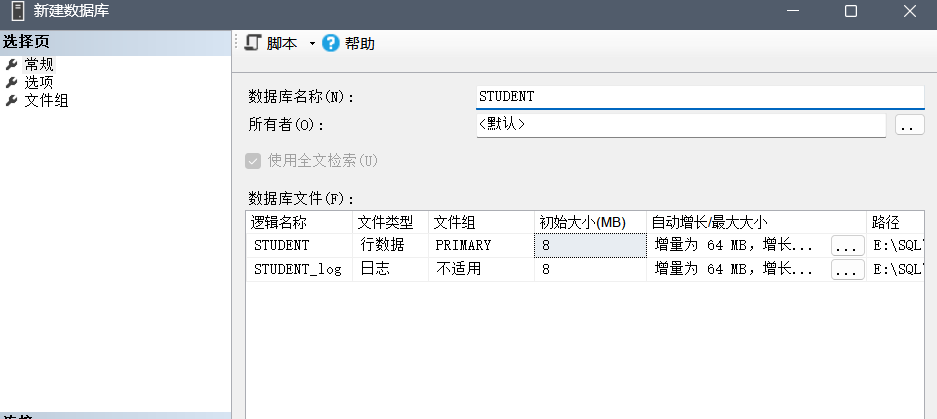
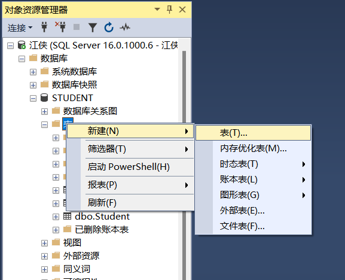
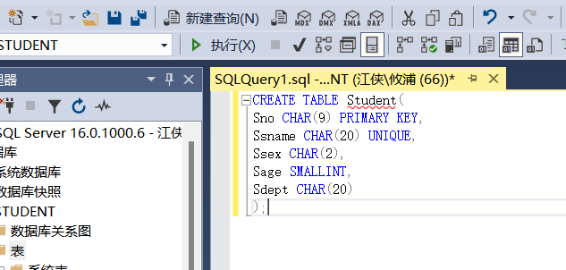
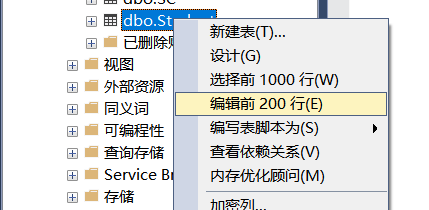
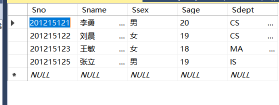
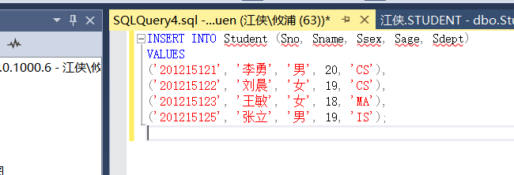

# 实验一：创建库表

### 一、实验内容

1 熟悉SQL Server的软件环境，了解SQL Server的功能

2 查看示例数据库对象。

3 创建STUDENT数据库，根据学生信息、课程信息和选修信息设计学生关系、课程关系 、选课关系，并创建对应的基本表student 、course 、 SC 

### 二、实验步骤

\1. 登录SQL Server数据库管理系统

\2. 熟悉SQL Server的操作环境，熟悉SQL Server支持的数据对象

\3. 根据需求设计学生数据库student，并创建

\4. 根据需求设计学生数据库的基本表student 、course 、 SC；

\5. 基本表录入数据；

### 三、思考题

1、SQL Server 数据库管理系统有哪些版本？你了解最新的SQL Server产品吗？还有哪些著名的大型数据库管理系统软件？

2、SQL Server 数据库管理系统的主要功能有那些？

### 四、实验报告

对于本实验的具体内容应该包括实验预习、实验记录和实验报告三部分。其中实验预习主要按照思考题的两个问题来完成；实验记录主要包括创建库、表的两种过程；实验报告的内容及具体要求主要格式按照实验报告本上的内容要求来写。

## 1. 创建数据库 STUDENT

点击数据库，右击



新建数据库，输入库名




##  2. 创建Student表

通过库直接建表：



或者可以通过命令行：

点击新建查询，输入以下内容



```sql
CREATE TABLE Student(
Sno CHAR(9) PRIMARY KEY,
Sname CHAR(20) UNIQUE,
Ssex CHAR(2),
Sage SMALLINT,
Sdept CHAR(20)
);
```

输入数据，右键对应的表，编辑前200行：



按行输入数据：



或者命令行输入数据：

```sql
INSERT INTO Student (Sno, Sname, Ssex, Sage, Sdept)
VALUES
('201215121', '李勇', '男', 20, 'CS'),
('201215122', '刘晨', '女', 19, 'CS'),
('201215123', '王敏', '女', 18, 'MA'),
('201215125', '张立', '男', 19, 'IS');
```




## 3. 建立Course表

用命令行：

```sql
CREATE TABLE Course (
    Cno VARCHAR(4) PRIMARY KEY,
    Cname VARCHAR(40) NOT NULL,
    Cpno VARCHAR(4),
    Ccredit SMALLINT
);
```

然后再使用命令行：

```sql
USE STUDENT
GO
ALTER TABLE Course 
ADD CONSTRAINT FK_Sn FOREIGN KEY(Cpno) REFERENCES Course(Cno) 
```

> 这一步是在 `Course` 表中添加一个外键约束，`Cpno` 列现在被定义为引用 `Course` 表中 `Cno` 列的外键。这意味着 `Course.Cpno` 中的值必须在 `Course.Cno` 列中存在，确保了数据的完整性。
>
> `Cpno` 是某个课程的前置课程编号，`Cno` 是课程编号，这个外键约束可以确保前置课程必须存在于 `Course` 表中。


输入数据：

```sql
INSERT INTO Course (Cno, Cname, Cpno, Ccredit) 
VALUES 
('1', '数据库', NULL, 5),
('2', '数学', NULL, 2),
('3', '信息系统', '1', 4),
('4', '操作系统', '6', 3),
('5', '数据结构', '7', 4),
('6', '数据处理', NULL, 2),
('7', 'PASCAL语言','6', 4);
```


## 4. 建立SC表

使用命令行：

```sql
CREATE TABLE SC(
Sno CHAR(9),
Cno varCHAR(4),
Grade SMALLINT,
PRIMARY KEY(Sno,Cno)
);
```

然后添加约束：

```sql
USE STUDENT;
GO
-- 添加外键约束 FK_Sno，引用 Student(Sno)
ALTER TABLE SC 
ADD CONSTRAINT FK_Sno FOREIGN KEY(Sno) REFERENCES Student(Sno);

-- 添加外键约束 FK_Cno，引用 Course(Cno)
ALTER TABLE SC 
ADD CONSTRAINT FK_Cno FOREIGN KEY(Cno) REFERENCES Course(Cno);
```

> - **`REFERENCES Student(Sno)`**: 表示 `SC` 表中的 `Sno` 外键引用了 `Student` 表中的 `Sno` 列，要求 `SC` 表中插入的每个 `Sno` 值必须在 `Student` 表中存在。换句话说，如果在 `Student` 表中没有对应的 `Sno`，就无法将该值插入到 `SC` 表。
> - **`REFERENCES Student(Cno)`**: 确保 `SC` 表中的 `Cno`（课程编号）必须是 `Course` 表中的有效课程编号。

输入数据：

```sql
INSERT INTO SC (Sno, Cno, Grade) 
VALUES 
('201215122', '2', 90),
('201215121', '1', 92),
('201215121', '2', 85),
('201215121', '3', 88),
('201215122', '3', 80);
```

## 思考题
1、**SQL Server 数据库管理系统的版本**：
- **主要版本**：Enterprise、Standard、Web、Express、Developer。
- **最新版本**：SQL Server 2022，集成 Azure、改进性能和安全性。
- **其他大型数据库管理系统**：Oracle、MySQL、PostgreSQL、IBM Db2、MongoDB。

 2、**SQL Server 的主要功能**：
- **数据存储与管理**：关系型数据管理、表和索引创建。
- **查询与分析**：T-SQL 查询语言和查询优化。
- **事务与并发控制**：支持 ACID 事务和并发控制。
- **数据安全**：加密、权限管理和安全认证。
- **高可用性**：Always On、备份与恢复。
- **数据集成**：ETL、云数据同步。
- **性能监控**：工具优化和性能监控。

（time：2024.10.23）


---


---

# 实验三：数据库更新和视图的基本操作

### 一、实验内容

该实验项目实验内容包括：SQL数据库更新操作，定义视图和视图操作，其他操作，重点是SQL数据库更新操作。

1 向S表中添加一个学生纪录，学号为S7, 姓名为高大全，性别为男，年龄为20，系别为计算机

2 将所有学生的成绩加5

3 将高大全同学所在系改为‘信息’

4 删除姓名为高大全同学的学生纪录

5 李晨选修了1号课程，把这个选修关系插入到基本表

6 把没有考试成绩的学生的成绩改为30分

7 把李晨1号课程的成绩改为78；

8把选修了“2”号课程，且成绩低于该门课程的平均成绩的学生的成绩提高5%；

9把选修了“2”号课程，且成绩低于该门课程的平均成绩的学生成绩删除掉

10 建立一个名为StudentSumView的视图，包含计算机系学生所有学生学号和总成绩

11  建立选修了课程‘程序设计’并且成绩大于80分的学生的姓名、成绩

12将“CS”系全体学生的成绩置零；

13 删除StudentSumView视图

14 删除S所有记录

15 删除S表

16 删除STUDENT数据库

### 二、思考题

1、怎样保持数据库中数据的完整性？

2、视图的的操作和基本表的操作有何异同点？

## 三、实验报告

对于本实验的具体内容应该包括实验预习、实验记录和实验报告三部分。其中实验预习首先要思考以上的两个问题，第二要把熟悉相关的SQL语句，重点是SQL数据库更新操作；实验记录主要包括对基本表进行SQL数据库更新操作、定义视图和视图查询操作以及其他操作等的步骤；实验报告的内容及具体要求主要格式按照我系的实验报告本上的内容要求来写。