# 实验二：SQL语言使用

### 一、实验内容

第一部分：

1 使用上次实验创建的数据库和表，利用企业管理器或查询分析器向基本表中插入实验数据。

第二部分：

2 查询全体学生学号和姓名

3 查询全体学生学号、姓名、性别、年龄和所在系

4 查询全体学生选课情况，即学号、课程号、成绩

5 显示所有选课学生的学号，并取掉重复行

6 查询成绩大于80分的学生的学号、课程号、成绩

7 查询计算机系全体学生的学号

8 查询计算机系年龄在18岁以上的学生的学号、姓名

9 查询选修了数据库课程或数据结构课程学生的学号、成绩

10 查询选修了C1课程的学生的学号和成绩，查询结果按成绩降序排序

11 查询每个学生的学号、姓名、选修的课程名、成绩

12 查询与‘李勇’在同一个系学习的学生学号、姓名

13 查询选修了3门以上课程的学生学号

14 查询没有选修课程的学生的基本信息

15 找出平均成绩在85分以上的学生，结果按系分组，并按平均成绩的升序排列

16查询选修课程平均成绩在80分以上的学生学号

17查询数据结构课程的先行课的先行课课程名

18 查询同时选修《数据库》和《数据结构》两门课程的学生姓名

19 查询每个系的平均年龄，并建立视图

20 建立课程的先修课程的视图

### 二、思考题

1、对于实验任务的完成，SQL Server 提供了哪些方法或工具？

2、请考虑SQL Server 的企业管理器和查询分析器中用SQL语句两种方法完成任务的场合和优缺点。

---


## 题目1
1 使用上次实验创建的数据库和表，利用企业管理器或查询分析器向基本表中插入实验数据。

第二部分：
## 题目2
2 查询全体学生学号和姓名
```sql
SELECT Sno, Sname
FROM Student;
```
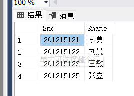

## 题目3
3 查询全体学生学号、姓名、性别、年龄和所在系
```sql
SELECT Sno, Sname, Ssex, Sage, Sdept
FROM Student;
```
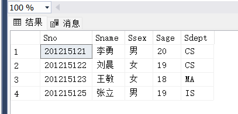
## 题目4
4 查询全体学生选课情况，即学号、课程号、成绩 
```sql
SELECT Sno, Cno, Grade
FROM SC; 
```
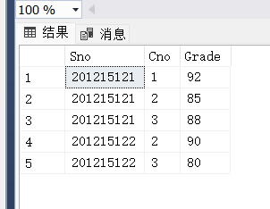
## 题目5
5 显示所有选课学生的学号，并取掉重复行
```sql
SELECT DISTINCT Sno
FROM SC;
```
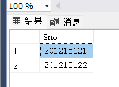

## 题目
6 查询成绩大于80分的学生的学号、课程号、成绩
```sql
SELECT Sno, Cno, Grade
FROM SC
WHERE Grade > 80;
```
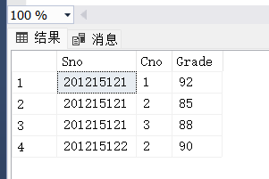

## 题目7
7 查询计算机系全体学生的学号
```sql
SELECT Sno
FROM Student
WHERE Sdept = 'CS';   --单引号

```

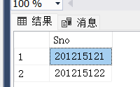

## 题目8
8 查询计算机系年龄在18岁以上的学生的学号、姓名
```sql
SELECT Sno, Sname
FROM Student
WHERE Sdept = 'CS' AND Sage > 18;  --用AND
```
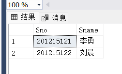

## 题目9
9 查询选修了数据库课程或数据结构课程学生的学号、成绩
```sql
SELECT Sno, Grade
FROM SC
WHERE Cno = '1' OR Cno = '5';
```
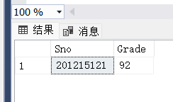

## 题目10
10 查询选修了C1课程的学生的学号和成绩，查询结果按成绩降序排序
```sql
SELECT Sno, Grade
FROM SC
WHERE Cno = '1'
ORDER BY Grade DESC;
```
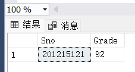

## 题目11
11 查询每个学生的学号、姓名、选修的课程名、成绩
```sql
SELECT Student.Sno, Student.Sname, Course.Cname, SC.Grade
FROM Student
JOIN SC ON Student.Sno = SC.Sno
JOIN Course ON SC.Cno = Course.Cno;
```
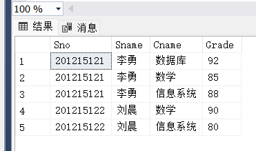

## 题目12
12 查询与‘李勇’在同一个系学习的学生学号、姓名
```sql
SELECT Sno, Sname
FROM Student
WHERE Sdept = (SELECT Sdept FROM Student WHERE Sname = '李勇')
```
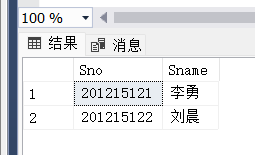

## 题目13
13 查询选修了3门以上课程的学生学号
```sql
SELECT Sno
FROM SC
GROUP BY Sno //根据学号进行分组
HAVING COUNT(Cno) > 3; //筛选学号中满足特定条件的组
```
`HAVING` 子句用于 **过滤分组后的数据**，通常和 `GROUP BY` 子句一起使用。它的作用类似于 `WHERE`，但不同之处在于：
- `WHERE` 子句用于在 **分组之前** 对数据进行过滤。
- `HAVING` 子句用于在 **分组之后** 对分组结果进行过滤。

| **对比维度**        | **GROUP BY**                                           | **ORDER BY**                                        |
|---------------------|--------------------------------------------------------|-----------------------------------------------------|
| **作用**            | 对查询结果按指定列进行**分组**。                        | 对查询结果按指定列进行**排序**。                    |
| **常用场景**        | 与聚合函数一起使用，如 `COUNT()`、`SUM()`、`AVG()` 等。 | 用于控制查询结果集的显示顺序。                      |
| **是否影响结果内容**| **是**，对结果进行分组后，每组只返回一条汇总数据。      | **否**，不改变结果内容，只改变结果的顺序。          |
| **常用子句/函数**   | 常与 `HAVING` 和聚合函数（如 `SUM()`、`COUNT()`）结合使用。| 常与 `ASC`（升序）、`DESC`（降序）结合使用。          |
| **位置**            | 位于 `SELECT` 之后，`ORDER BY` 之前。                   | 通常是查询语句的最后一个子句。                      |
| **示例**            | ```sql SELECT Sdept, AVG(Sage) FROM Student GROUP BY Sdept; ``` | ```sql SELECT Sname, Sage FROM Student ORDER BY Sage DESC; ```|
| **应用的列**        | 必须是 `SELECT` 中未聚合的列或计算结果。                 | 可以是任意列或表达式，即使它不在 `SELECT` 中出现。    |
- **`GROUP BY`** 用于对数据进行分组，并计算每个分组的汇总信息。
- **`ORDER BY`** 用于对查询结果进行排序，不改变数据，只改变结果的排列顺序。
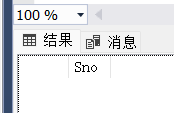

## 题目14
14 查询没有选修课程的学生的基本信息
```sql
SELECT *
FROM Student
WHERE Sno NOT IN (SELECT Sno FROM SC);
```
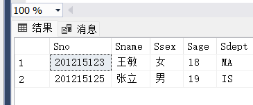

## 题目15
15 找出平均成绩在85分以上的学生，结果按系分组，并按平均成绩的升序排列
```sql
SELECT Student.Sdept, Student.Sno, AVG(SC.Grade) AS AvgGrade
FROM Student
JOIN SC ON Student.Sno = SC.Sno
GROUP BY Student.Sdept, Student.Sno 
--根据学生的系别（`Sdept`）和学号（`Sno`）对结果进行分组。
HAVING AVG(SC.Grade) > 85
ORDER BY AvgGrade ASC;
```
//**`AVG(SC.Grade) AS AvgGrade`**：计算每个学生的平均成绩，并将结果命名为 `AvgGrade`。
- 使用 `JOIN` 关键字将 `Student` 表和 `SC` 表连接在一起。
- `ON Student.Sno = SC.Sno`：指定连接条件，即通过学号（`Sno`）将两张表关联起来。这样可以获取每个学生的成绩信息。
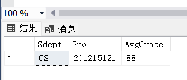

## 题目16
16查询选修课程平均成绩在80分以上的学生学号
```sql
SELECT Sno
FROM SC
GROUP BY Sno
HAVING AVG(Grade) > 80;
```
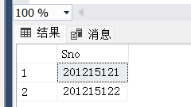

## 题目17
17查询数据结构课程的先行课的先行课课程名
```sql
SELECT C2.Cname AS PrePreCourse
FROM Course C1  //指定数据源为 `Course` 表，并给它一个别名 `C1`。这个别名用于后续的引用
JOIN Course C2 ON C1.Cpno = C2.Cno
WHERE C1.Cno = '5';
```
- `JOIN` 允许我们把 `Course C1` 和 `Course C2` 的相关信息组合起来，这样我们就能从查询到的结果中返回前置课程的名称，而不是编号。
- 最终，我们根据 `C1.Cno = '5'` 的条件，查询编号为 `5` 的课程的前置课程，并通过 `JOIN` 得到前置课程的名称。
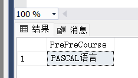

## 题目18
18 查询同时选修《数据库》和《数据结构》两门课程的学生姓名
```sql
SELECT Sname 
FROM SC AS SC1
JOIN SC AS SC2 ON SC1.Sno = SC2.Sno
JOIN Student  ON SC1.Sno = Student.Sno
WHERE SC1.Cno = '1' AND SC2.Cno = '5';
```
 `JOIN SC AS SC2 ON SC1.Sno = SC2.Sno`：
- 通过这个 `JOIN`，我们确保 `SC1` 和 `SC2` 中的 `Sno`（学生编号）是相同的，表示同一个学生。

 `JOIN Student ON SC1.Sno=Student.Sno `：
- 在这一步，我们将 `SC` 表和 `Student` 表连接起来，关联 `SC1.Sno` 和 `Student` 表中的 `Sno`。

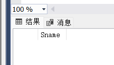

## 题目19
19 查询每个系的平均年龄，并建立视图
```sql
CREATE VIEW AvgAgeByDept AS
SELECT Sdept, AVG(Sage) AS AvgAge
FROM Student
GROUP BY Sdept;
```
- GREATE VIEW创建视图，后面是自定义的名称，AS表示后面讲定义这个视图的查询内容
```sql
SELECT * FROM AvgAgeByDept;
```
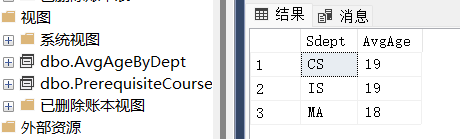

## 题目20
20 建立课程的先修课程的视图
```sql
CREATE VIEW PrerequisiteCourses AS
SELECT C1.Cno AS CourseNo, C1.Cname AS CourseName, C2.Cname AS PrerequisiteName
FROM Course C1
LEFT JOIN Course C2 ON C1.Cpno = C2.Cno;

```
- `LEFT JOIN` 是 SQL 中的一种连接操作，用于将两个表中的数据结合起来。具体来说，`LEFT JOIN` 会返回左侧表（在这个例子中是 `Course C1`）的所有记录，以及右侧表（在这个例子中是 `Course C2`）中符合连接条件的记录。如果右侧表中没有符合条件的记录，则结果中将包含左侧表的记录和右侧表中对应列的 `NULL` 值。
- **Course C2**：这是右侧表的名称（即你要连接的表）。在这里，你正在连接的表是 `Course`，并将其命名为 `C2`。
- **ON C1.Cpno = C2.Cno**：这是连接条件，指定了如何将左侧表（`C1`）和右侧表（`C2`）进行匹配。
	- - 从 `C1` 表中的 `Cpno` 列（通常表示课程的先修课程编号）与 `C2` 表中的 `Cno` 列（表示课程编号）进行比较。
	- 只有当 `C1.Cpno` 的值与 `C2.Cno` 的值相等时，才会将这两个表中的记录组合在一起。
```sql
SELECT * FROM PrerequisiteCourses;
```
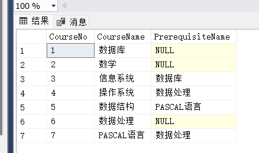
## 二、思考题

1、对于实验任务的完成，SQL Server 提供了哪些方法或工具？

2、请考虑SQL Server 的企业管理器和查询分析器中用SQL语句两种方法完成任务的场合和优缺点。

1、SQL Server 提供了哪些方法或工具？

| 工具/方法               | 描述                                          | 适用场合                                       |
|-----------------------|---------------------------------------------|----------------------------------------------|
| **SQL Server Management Studio (SSMS)** | 一个集成环境，用于管理 SQL Server 和 Azure SQL 数据库。 | - 数据库管理<br>- 编写和执行 SQL 查询<br>- 数据备份和恢复 |
| **SQL Server Data Tools (SSDT)** | 用于数据库开发和管理的工具，支持项目和解决方案。 | - 开发和测试 SQL Server 数据库项目<br>- 集成到 Visual Studio |
| **SQL Server Profiler** | 用于监控 SQL Server 的工具，可以跟踪和分析 SQL 事件。 | - 性能监控<br>- 调试存储过程和查询 |
| **Transact-SQL (T-SQL)** | SQL Server 的扩展 SQL 语言，支持复杂查询和逻辑。 | - 数据查询<br>- 数据修改和管理 |
| **SQL Server Agent** | 任务调度和作业管理工具，用于自动化常规任务。 | - 定时备份<br>- 自动化报告生成 |
| **SQLCMD**           | 命令行工具，用于与 SQL Server 进行交互。  | - 批量执行 SQL 脚本<br>- 自动化任务 |
| **Enterprise Manager** | 旧版 SQL Server 的管理工具，提供数据库和服务器管理功能。 | - 基本数据库管理和监控 |
| **Power BI**         | 数据可视化工具，用于将 SQL Server 数据可视化。 | - 数据分析<br>- 报告和仪表盘创建 |


2、请考虑SQL Server 的企业管理器和查询分析器中用SQL语句两种方法完成任务的场合和优缺点。

| 特性       | 企业管理器                       | 查询分析器                       |
| -------- | --------------------------- | --------------------------- |
| **使用场合** | - 适合不熟悉 SQL 语法的用户           | - 适合需要执行复杂查询或脚本的用户          |
|          | - 适合进行简单的数据库管理任务            | - 适合进行批量操作和数据分析             |
| **优点**   | - 界面友好，操作简单，易于上手            | - 支持复杂的 SQL 语句，能够执行多行和多条语句  |
|          | - 具备可视化工具，如拖放功能，便于构建查询和报告   | - 支持脚本和存储过程的调试              |
|          | - 方便进行数据的导入和导出，用户管理等任务      | - 可以直接执行和测试 SQL 查询，实时反馈查询结果 |
|          | - 提供了数据模型视图，便于理解数据库结构       | - 可用强大的编辑功能，如语法高亮、代码补全      |
| **缺点**   | - 对于复杂查询支持有限，难以处理复杂的 SQL 逻辑 | - 界面较为简陋，对于新手用户学习成本较高       |
|          | - 不适合批量数据处理和大规模的数据迁移        | - 缺乏直观的可视化工具，数据管理不如企业管理器方便  |
|          | - 一些高级功能难以通过 GUI 完成         | - 执行错误的 SQL 语句可能导致数据损坏，风险较高 |
| **总结**   | - 适合进行简单的数据库操作，适合新手         | - 适合需要精细控制和复杂操作的用户          |


## 三、实验报告

对于本实验的具体内容应该包括实验预习、实验记录和实验报告三部分。其中实验预习首先要思考以上的两个问题，第二要把熟悉相关的SQL语句；实验记录主要包括向基本表输入信息，查询的结果显示等步骤；实验报告的内容及具体要求主要格式按照实验报告本上的内容要求来写。

（time: 2024/10/24) 

