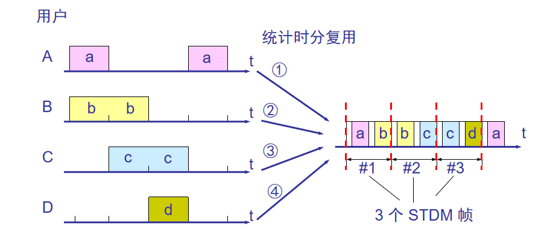
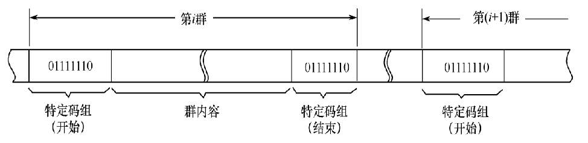
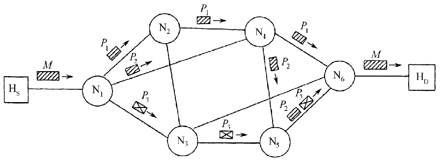

# 第4章 数据传输技术

本章介绍数据传输采用的各种技术，包括数字基带传输技术、数字频带传输技术、脉冲编码调制技术、信道访问技术、信道复用技术、扩展技术、同步控制技术等。数据传输技术和逻辑链路技术密切相关。

## 4.1 数字基带传输技术

基带信号(简称基带)是指原始的数据信号。基带信号中含有直流、低频率和其他频率成分的谐波分量。
直接利用基带信号的传输方式，称为基带传输。以基带传输方式实现的传输系统，称为基带传输系统。

为什么要研究基带传输呢？主要理由是：

①近距离传输常采用基带传输，颇有实用价值；

②多数传输系统对传输信号都有一个处理基带波形的过程；

③理论上可证明，任何一个带通传输系统总可以由一个基带传输系统来替代。

### 4.1.1 基带传输对信号的要求

1. 基带信号应有利于提高系统的频带利用率
2. 基带信号应尽量少地含有直流、甚低频及高频分量
3. 基带信号应含有足够大的可供提取定时信号的信号分量
4. 基带信号的码型应基本不受信源统计特性的影响
5. 基带信号的频谱能量要集中，所占宽带要窄，以利于增大传输距离和减少线对间的干扰
6. 基带信号的码型对噪声和码间串扰应具有较强的抵抗力和自检能力
7. 基带信号的变换电路应简单，成本低，性能好，易于调整

### 4.1.2 基带信号的波形及其传输码型

#### 1. 基带信号的波形

对于不同的基带传输系统，根据通信传输的性能和要求的不同，可采用不同的基带信号波形。基带信号有多种形式，常见的波形如图3-2所示。

- **(a) 单极性不归零码**：信号在“1”时为正电平，在“0”时为零电平。
- **(b) 双极性不归零码**：信号“1”时为正电平或负电平，信号“0”时为零电平。
- **(c) 单极性归零码**：在一个时间周期内，信号“1”时为正电平，但在该周期内会回归到零电平。
- **(d) 双极性归零码**：信号“1”时为正电平或负电平，且在每个时间周期的后半部分会回归到零电平。
- **(e) 曼彻斯特编码**：在一个时间周期内，信号“1”表示为高到低的跳变，信号“0”表示为低到高的跳变。
- **(f) 差分曼彻斯特编码**：通过信号电平的变化代表二进制数据，“1”表示无跳变，“0”表示有跳变。

图3-2展示了常用的几种基带信号波形及其特点。

#### 2. 常用的基带传输码型

⑴ 双相码。又称分相码、裂相码或曼彻斯特(Manchester)码。它用一个周期的方波表示1，而用它的反相波形表示0。 

⑵ 差分双相码。利用“差分”的概念，将双相码中用绝对电平表示的波形改为用电平的相对变化的波形。 

⑶ 传号交替反转码。记作AMI码。其编码规则是：信息0变换为基带信号幅度取值为零，而1则交替地变换取值为+E和-E的归零码。

⑷ 三阶高密度双极性码HDB3。

## 4.2 数字频带传输技术

基带传输在数据传输中并非占据主导地位。其原因是多数信道(尤其是无线电信道)并不能进行直接传输，必须用基带信号对载波波形的某些参量(振幅、频率和相位)进行控制，使这些参量随基带信号的变化而变化，成为以载波频率为中心的带通信号，这就是**“调制”**的概念。

- 调制”是为了实现频谱搬移，将数字基带信号变换成适合于信道传输的频带信号。
- 利用基带信号对载波参量的调制，称为**带通调制**。带通调制可将基带信号搬移到足够高的频率上，使得信号从天线发射出去。
- 已调信号在接收端需经解调恢复成原来的基带信号。但是，由于噪声和码间干扰的影响，恢复的信号会有一定的失真而引起误码。
- 为了降低误码率。接收方法可分为两大类：相干接收和非相干接收。利用载波相位信息去检测信号的方法称为相干检测或相干解调。反之，则称为非相干检测或非相干解调。

在数据通信系统中，一般选用形式简单、便于生成和接收的正弦信号作为载波。  

常用的正弦载波可表示为  $ s(t)=Acos(ωct+φc)＝Acos(2πfct+φc) $ 其中振幅A、频率fc（或角频率ωc）和相位φ都是时间的函数。

所以，基本调制有三种，即振幅调制、频率调制和相位调制。对于二进制信号，这三种调制分别称为振幅键控(ASK) 、频移键控(FSK) 和相移键控(PSK) 。 

#### 二进制正弦载波的键控方法和波形

- 调幅(AM)  ：载波的振幅随基带数字信号而变化 
- 调频(FM)  ：载波的频率随基带数字信号而变化
- 调相(PM)  ：载波的初始相位随基带数字信号而变化

### 4.2.1 基本数字调制技术

##### 1. 数字幅度调制

（1） 二进制幅度键控（2ASK）

- 基本思想：利用数字基带信号键控载波幅度的变化，即传送“1”信号输出正弦载波信号 $Acos(\omega_c t+\phi_c)$ ，传送“0”信号无载波输出。 

调制：

解调：

主要有包络检波法和相干解调法。
相干调解法的基本原理：将输入已调信号S(t)与相干载波信号C(t)在相乘器相乘后，再由低通滤波器过滤，即得所需的基带信号

>  实现相干解调的关键：有一个与ASK信号的载波保持同相同频的的相干载波，否则会产生波形失真。

（2）多进制幅度键控（MASK）

基本思想：利用多电平的矩形基带脉冲去控制正弦载波信号幅度。

##### 2. 数字频率调制

（1）二进制频移键控（2FSK）

2FSK信号一般用频率选择法和载波调频法。频率选择法产生相位不连续的2FSK信号。载波调频法产生相位连续的2FSK信号。

调制：

解调：

有相干解调法和非相干解调法。目前常用非相干解调法，虽然它的抗干扰性能不及相干解调法优越，但解调时无需从FSK信号中提取相干载波，因而实现起来比较简单。

（2）多进制频移键控（MFSK）

基本思想：利用M个不同频率的信号波形(如正弦波)来代表M进制的M个码元符号。 

解调：

> 注：数字相位调制没写

## 4.4 信道访问技术

- “访问”是指引起主、客体之间的信息相互交换或者系统状态改变的主、客体交互行为。
- 确保单一使用公用信道的技术称为信道访问技术。 

###  4.4.1 轮询访问技术

主机依照一定的顺序探询各结点有无传递信息的要求，被探询的结点如有传送要求就占用共有信道，将信息发给主机；否则，主机继续探询下一个结点。

##### 1. 轮叫轮询

流程：主机按照顺序从结点1开始，结点1有数据就发送给主机，没有数据就发送**控制帧**给主机。然后主机探询结点2，3……

在轮叫轮询访问控制时，假设主机向各节结点发送的探询帧为定长，其传输时间为 $t_0$，每个结点识别探询帧所需的时间是$t_s$。设各结点在多点线路上物理分布是均匀的，主机到最远结点的单程传播时间为$\tau$。

则探询系统的巡回时间L为：
$$
L=N(t_0+t_s)+(N+1)\tau
$$

##### 2. 传递轮询

流程：主机先向1发送探询帧，当结点1响应并将数据发回主机或者通知主机没有发送的数据史，**便将探询帧的接收地址修改为结点2**，接着将探询帧转发给结点2……直到结点N将数据发回主机或通知主机没有发送的数据，再将探询帧的接收地址修改为主机，重新将探询控制权交还给主机。

传递轮询允许被探询结点修改探询帧的接收地址，从而克服了轮叫轮询方式中主机一直掌握着发送探询帧的控制权，造成通信开销大、帧的传送时延长的缺点。

整个系统巡回时间的计算公式：
$$
L=Nt_s+2 \tau
$$

#### 传递轮询与轮叫轮询的比较
- 在相同条件下，传递轮询帧的时延比轮叫轮询的时延要小，而且结点间距离越大，其效果越明显。

- 因为传递轮询技术的实现较复杂，所以实际使用中还是以轮叫轮询为主。

### 4.4.2 争用访问技术

争用技术是一种随机访问技术。由于所有用户都可以根据自己的需要向公用信道发送信息，于是就产生了争用信道使用权的问题。只有争用获胜者才取得了信道使用权可以发送信息，而争用的存在又必然会发生冲突(或碰撞)，这就须解决冲突所带来的问题。

#### ALOHA技术

夏威夷大学最初研制的ALOHA称为纯ALOHA。系统设有一个主站和若干个从站，从站到主站的频率是407.35MHz，主站到从站的频率是413.475MHz，带宽各为100KHz，数据传送速率为9600b/s。

==1 纯ALOHA==

每一站均可自由地发送帧，并利用应答技术来确保发送的成功。**当从站发送一个帧之后，必须等待主站的应答帧予以确认，方能继续发送下一帧。**如果未收到应答信号，就意味着发生了帧的冲突，必须进行重发。

**纯ALOHA采用让发生帧冲突的从站各自等待一段随机的时间后再进行重发的策略，直到发送成功为止。**

==2 时隙ALOHA==

为了提高纯ALOHA系统的吞吐量，可使各站在同步状态下工作，并把时间划分为等长的时隙，通过预约技术来争用信道的使用权。**同时规定无论帧何时到达，都只能在每个时隙的开始时刻才能发送出去**。这种ALOHA称为时隙ALOHA。

==3 预约ALOHA。==

上述两种ALOHA信道利用率都比较低，有人提出把预约和争用技术结合起来，让各站都以某种方式预约某个帧的发送时隙。这样就保证了所发送的帧不会与别的站发送的帧发生冲突。这种ALOHA称为预约ALOHA。
预约ALOHA的基本思想是：在网络负载轻时按ALOHA方式工作，而当网络负载重时按近似于时分复用方式工作。

#### CSMA技术

CSMA是对用于有线信道ALOHA系统的一种改进，它要求每个站都设置一硬件(即载波监听装置， “载波”是指在公用信道上传输的信号。)，**用来在发送数据之前监听同一信道上其他站是否也在发送数据**。如果该站监听到有别的站正在发送，就暂不发送数据，从而减少发送冲突的可能性，也提高了整个系统的吞吐量和信道利用率。

根据每个站所采用的载波监听策略，CSMA可分为以下几种类型：
  ① 非坚持CSMA    如果进行载波监听时发现信道空闲，则将准备好的帧发送出去；如果监听到信道忙，就不再继续坚持听下去，而根据协议的算法延迟一个随机时间再重新监听。

② 1坚持CSMA    当监听到信道空闲时，就立即发送帧；如果监听到信道为忙，则继续监听下去，一直坚持到信道变成空闲为止。

③ P坚持CSMA    当监听到信道为空闲时，以概率p立即发送帧，而以概率(1- p)延迟一段时间τ (端─端传播时延)再重新监听信道；当监听到信道为忙时，则继续监听下去，一直坚持到信道空闲为止。

#### 环访问技术

==（1）令牌环==

令牌环是一种最早提出的环访问技术。利用令牌环技术构成的局域网有Newhall环网和IBM令牌环网。它们是制定IEEE 802.5标准的基础。

令牌环技术的优点是易于调节通信量。缺点是令牌操作和管理复杂

原理：利用在环路中流动的唯一的令牌帧。初始状态时，不含有数据的令牌帧称为“闲”令牌帧。要求传输数据的站必须等待令牌帧的到达，**如检测是“闲”的，于是就通过改变其比特组合将令牌由“闲”改成“忙”**，并在此令牌后面传输待发送的数据。

此时环路上因没有“闲”令牌，其他希望发送数据的站必须等待。当包含数据的“忙”令牌帧沿环路传送到非目的站时，则转发该帧。只有当它传送到目的站时，目的站才复制该帧的有关信息，并继续转发该帧。这个“忙”令牌帧绕环一周后又返回到源站，则由源站对数据实施检查和回收，并将“忙”改为“闲”。

- 由于令牌是唯一的，在任何情况下，令牌都保证一次仅有一个站在传输数据。只有当源站释放出一个新的“闲”令牌时，处于下游的有传输数据要求的站才能截获“闲”令牌并进行数据传输.

令牌环技术应具有故障恢复机制。

- 令牌丢失   ：由令牌主动管理站采用超时机制来检测令牌的丢失情况。
-  恢复令牌  ：由管理站重新生成一个“闲”令牌。
- 一张令牌  ： 由管理站检测持续循环的“忙”令牌，通过设置管理比特，自动地将“忙”令牌更改为“闲”令牌。
- 管理站有效 ： 被管理站通过检测主动站是否故障，采用竞争算法产生新的主动站。  

==（2）时隙环==

原理：把信息在环路上的传送时间划分为固定长度的时间段(简称时隙)。每一个时隙都含有一先导标志位，表示该时隙的现行状态：空或满。若干时隙在环路上绕环运行。初始时，所有的时隙都是空的。要求传送数据的站必须等待一个空时隙到达，将先导标志位改为满，同时在时隙中加入所要传送的数据。当载有数据的时隙到达目的站时，目的站将复制时隙中的数据，同时设置响应位，以表征接收的状态(接收、拒收和忙)。只有当时隙返回到源站时，才将时隙先导标志位重新改为空，以便该时隙供下游的结点继续使用。

## 4.5 信道复用技术

复用(multiplexing)是通信技术中的基本概念。

动机：因为信道的带宽往往要比所传送的信号的带宽宽得多，要充分利用信道的容量，提高信道的传输效率，就开发了信道复用技术。

信道多路复用的理论依据是**信号分割原理**。实现信号分割是基于信号之间的差别(存在于信号的频率、时间参量以及码型结构) 。

多路复用是一种将若干路彼此无关的信号合并成一路复合信号，并在一条公用信道上传输，到达接收端后再进行分离的技术。包含**信号复合，传输和分离**三个方面。

###  频分复用

频分多路复用FDM(Frequency Division Multiplexing)是按照频率参量的差别来分割信号的技术。

基本思路：把信道的可用频带分割为若干条较窄的子频带，用户自始至终使用分配到的子频带来传输信号。所有用户在同样的时间占用着不同的带宽资源(请注意，这里的“带宽”是频率带宽而不是数据的发送速率)。

 

FDM的主要优点：①实现简单；②技术成熟；③能较充分地利用信道频带，因而系统效率较高。

FDM的主要缺点：①保护频带的存在，大大地降低了FDM技术的效率；②信道的非线性失真，改变了它的实际频带特性，易造成串音和互调噪声干扰；③所需设备量随输入路数增加而增多，且不易小型化；④频分多路复用本身不提供差错控制技术，不便于性能监测。

> 在实际应用中，FDM正在被时分多路复用所替代。

### 波分复用

波分复用是传统的频分复用技术应用于光纤通信领域，因此波分复用的本质是频分复用。

波分复用是将1根光纤转换为多条“虚拟”光纤，每条虚拟光纤独立工作于不同波长，从而极大地提高了光纤的传输容量，充分发挥了光纤的潜在能力。

波分复用通常有3种复用方式。

①1310nm和1550nm波长的波分复用

②粗波分复用CWDM

③密集波分复用DWDM

波分复用的特点：
①利用光纤低损耗波段，增加了光纤的传输容量。

②在一根光纤中传送2个或数个非同步信号，这有利于数字信号和模拟信号的兼容。

③对已建光纤系统，只要原系统有功率余量，便可进行增容，因而有较强的灵活性。

④光纤使用量的减少，降低了建设成本。

⑤有源光设备的共享性，降低了成本。

⑥系统中有源设备的减少，提高了系统的可靠性。

### 时分复用

==1、传统时分复用==
时分多路复用（TDM）是按照**时间参量**的差别来分割信号的技术。

时分复用是**将时间划分为一段段等长的时分复用帧**(TDM 帧)。每一个时分复用的用户在每一个 TDM 帧中占用固定序号的时隙。每一个用户所占用的时隙是周期性地出现(其周期就是 TDM帧的长度)。因此，TDM 信号也称为等时(isochronous)信号。

时分复用的所有用户是在**不同的时间占用同样的频带宽度。** 

传统TDM的特点：
①通信双方是按照预先指定的时隙进行通信的，而且这种时间关系是固定不变的；

②就某一瞬时来看，公用信道上仅传输某一对设备的信号，而不是多路复合信号，但就一段时间而言，公用信道上传送着按时间分隔的多路复合信号。

③只要时分多路复用器的扫描操作适当，以及采取必要的缓冲措施和合理地分配时隙，就能够保证多路通信的正常进行。

==2、统计时分多路复用==

使用传统时分多路复用来传输计算机数据，由于计算机数据的突发性，用户对分配到的子信道的利用率一般是不高的。

当某用户暂时无数据发送时，在时分复用帧中分配给该用户的时隙只能处于空闲状态，从而造成资源浪费。

传统时分复用：

为了提高时隙的利用率，可以采用按需分配(或动态分配)时隙，以避免每帧中出现闲置时隙的现象。这种动态分配时隙的TDM，称为统计时分多路复用STDM(Statistic TDM)。

STDM也存在技术缺陷。如当复用器连接的设备较多，又都处于工作状态,或者少数设备发送很长的数据块，将会出现与数据块和排队有关的时延加剧问题。又如当传输出现差错时造成一个或数个帧数据重发，将会导致时延的加剧。

### 码分复用

==概念==

码分复用是利用每个码元的码组的正交性来分割信号的一种技术。

常用的码分复用是码分多址CDMA。每个用户使用经过特殊挑选的不同码型，故在同样的时间内使用同样的频带进行通信，而不会造成相互干扰。 

码分复用技术最初用于军事通信，现已广泛用于民用移动通信，如无线局域网。

CDMA技术可提高话音质量和数据传输的可靠性，减少干扰对通信的影响，增大通信系统的容量(是GSM的4～5倍)，以及减少平均发射功率等。

==实现==

每一个比特时间被划分为m个间隔，称为码片(chip)。通常m的值是64或128。

使用CDMA的每一个站被分派一个唯一的bit码片序列（chip sequence）。

一个站如果要发送比特1，则发送它自己的m bit码片序列。如果要发送比特0，则发送该码片序列的二进制反码。

> 例如，S 站的 8 bit 码片序列是 00011011。
> 发送比特 1 时，就发送序列 00011011，
> 发送比特 0 时，就发送序列 11100100。
>
> 为了方便，我们以后将两码片中的0写成–1，将1写为+1。  因此，S 站的码片序列：(–1 –1 –1 +1 +1 –1 +1 +1)

==码分序列实现了扩频==
假定S站要发送信息的数据率为 b bit/s。由于每一个比特要转换成 m 个比特的码片，因此 S 站实际上发送的数据率提高到 mb bit/s，同时 S 站所占用的频带宽度也提高到原来数值的 m 倍。

CDMA系统采用的码片具有如下**特性**：

令向量A表示A站的码片向量，再令B表示其他任何站的码片向量。 

① 分派给每一个站的码片不仅互不相同，并且必须互相正交(orthogonal)。向量A和B的内积都是0。
$$
A \bull B = \frac{1}{m}\sum_{i=1}^{m}A_iB_i =0
$$
 ② 任何一个码片向量的规格化内积都是1。一个码片向量和该码片反码的向量的规格化内积值是– 1。
$$
A \bull A = \frac{1}{m}\sum_{i=1}^{m}A_iA_i =\frac{1}{m}\sum_{i=1}^{m}{A_i}^2=1
$$
工作原理举例：

题目：

若有4个站进行码分多址CDMA通信。4个站的码片序列为：

A:  (-1 -1 -1 +1 +1 -1 +1 +1)

B:  (-1 -1 +1 -1 +1 +1 +1 -1)

C:  (-1 +1 -1 +1 +1 +1 -1 -1)

D:  (-1 +1 -1 -1 -1 -1 +1 -1)

现收到这样的码片序列： （-1 +1 -3 +1 -1 -3 +1 +1），问哪个站发送了数据？发送的数据的站发送的1还是0？

解题：

$S\bull A = \frac{1}{8}\sum_{i=1}^{8}SA = 1$        A发送了数据，发送的是1

$S\bull B = \frac{1}{8}\sum_{i=1}^{8}SB = -1$     B发送了数据，发送的是0

$S\bull C = \frac{1}{8}\sum_{i=1}^{8}SC = 0$         C没有发送数据

$S\bull D = \frac{1}{8}\sum_{i=1}^{8}SD = 1$         D发送了数据，发送的是1

## 4.6 同步控制技术

同步——指通信双方在发送和接收信号时建立起来的确定通信关系，是数据通信系统不可或缺的重要环节。

> 同步控制技术的主要作用是**确保通信双方的信号、时钟、码片序列或频率保持一致**，从而避免干扰、减少误码、提高系统效率。没有同步技术，通信系统的可靠性和性能都会受到严重影响。

按照要求同步的对象不同，可分为载波同步、位同步、群同步和网同步。

### 载波同步

在相干解调系统中，**接收端必须提供一个与发送端同频同相的相干载波**，这一过程称为载波同步。

> 载波同步就是在接收端找到和发送端完全相同的频率，让接收和发送“在同一个节奏上”，从而能够准确解码和接收到正确的信息。如果没有同步，接收端就像跳错舞步一样，无法正确“听到”或解码信息。

载波同步的基本要求是：

①同步误差(指相位误差)小；

②建立同步的时间短； 

③同步保持时间长；

④为同步所占用的功率小及频带窄。

实现载波同步的方法有两类：

一类是如接收的已调信号频谱中已含有载波分量或载波导频分量，则直接提取；

另一类是对于抑制载波而又没有插入导频的已调信号，则通过非线性变换或采用锁相环来获取载波。

#### 插入导频法

插入导频法(又称外同步法)可分为**频域插入和时域插入**。 

频域插入的基本原理：发送端在发送有用信号频谱的同时，在其适当的位置**插入一个低功率的线谱**(其对应的正弦信号称为导频信号)，这样接收端就可以利用窄带滤波器把它提取出来，再经适当处理后形成相干载波。

应注意：①导频的频率应与载频有关；②插入导频的位置应在信号频谱的零点处，且要求载频附近的信号分量尽量小。  

> 可以把频域插入想象为在一首乐曲中加入一个独立的乐器（导频信号），这个乐器的音调与歌曲的主旋律（载波）密切相关。虽然音量（功率）较小，但接收端可以通过专门的设备（窄带滤波器）准确地捕捉到这个乐器的音调，从而重新同步歌曲的节奏（载波）。

时域插入的基本原理：在特定的时间片上插入导频信号，接收端用锁相环进行提取。在这种方式下，导频信号和数据信号分别占据不同的时间片。接收端通过锁相环等设备提取导频信号，恢复载波同步。

> 时域插入可以类比为在连续播报的新闻节目中，定期插入一个广播信号让收音机同步。虽然这些信号短暂出现，但足够让接收设备调整到正确的频率，确保接下来听到的新闻是清晰的。

### 位同步

在数据通信系统中，接收端必须有一个与发送端码元定时脉冲频率相同、相位与最佳取样时刻一致的码元定时脉冲序列。接收端产生这种码元定时信号的过程，称为位同步(或码元同步)。

位同步的关键是：

1. **频率同步**：接收端的定时脉冲的频率必须与发送端的码元定时频率相同。这样，接收端每隔一个固定的时间间隔就能够对接收到的信号进行采样。
2. **相位同步**：接收端的取样时刻必须与发送端的码元开始时刻一致，以便在接收到的信号的正确位置进行采样。这可以确保接收端在最清晰的时间点读取到码元，而不是在噪声较多的时刻。

对位同步的基本要求以及它的实现方法，与载波同步相类似。

> 可以把位同步类比为两个正在“打拍子”的人，一个是发送端，另一个是接收端。为了让接收端能够准确地理解发送端的“节奏”（码元序列），接收端需要对发送端的拍子保持同步。不仅需要跟上拍子的节奏（频率），还需要在正确的时刻落下拍子（相位），这样才能准确解读发送的每一个信号。

#### 插入导频法

为了获取码元定时信号，必须确定接收到的信号中是否存在位定时的频率分量。如果有此频率分量，则用滤波器直接提取。如不存在位定时信息，则需在信号中插入位同步的导频信号，或者对其进行某种码型变换以获取位定时信息。

频域插入导频法是将导频信号插入基带信号频谱的零频处。

时域插入导频法是发送端在每帧指定时间间隔内发送位定时信号，接收端用锁相电路提取并保持它，这样就可对后继的数据信号正确地进行取样判决。

### 群同步

实现帧或信息包同步传输的过程，称为群同步。群同步一般是通过数据格式的特殊设计来达到的，亦即通过在数据码元序列中**插入特定的同步码元或同步码组**来实现群同步。

***因此，实现群同步的关键在于如何识别插入的同步标志。***

> 可以将**群同步**类比为读书时使用的章节标记。每一章的开头有一个章节标题（同步标志），读者（接收端）通过看到这个标题知道新的一章开始了。而有些书则通过内容的模式让读者自然分辨出章节的划分，这相当于内同步法。

群同步的基本要求：①同步可靠性高，即漏同步率和假同步率低；②同步平均建立时间短；③为实现群同步而插入到数据码元序列中的群同步码元或群同步码组的冗余度小。

实现群同步的方法分两类：

一类是在发送的码元序列中插入专门设计的群同步码元或群同步码组，称为**外同步法**；

另一类是利用码元序列的本身特性来提取群同步信号，称为**内同步法**。

#### 起止位同步法

- 利用起止位实现异步传输的方法。

- 此时，以一个字符为传输单位，并用起始位表示字符的开始，用停止位表示字符的结束。
- 因此**群是由起始位、字符位及停止位构成的**。
- 此法简单灵活，适用于速率不高的场合。

#### 特定码组同步法

- 利用特定码组(特定的若干比特组合)来实现群同步的方法。
- **群是由群数据块加上首尾特定码组构成。**
- 接收端通过识别该特定码组来实现群同步。例如，在HDLC规程中，这个特定码组为01111110。

#### 特定字符同步法

- 利用特定字符作为同步标志来实现群同步的方法。
- 数据块由包括控制字符和数据字符在内的字符序列构成，以两个或两个以上的特定字符作为数据块的开始标志。
- 例如，传输控制字符SYN(0010110)就是专门设置的同步字符。

对**起止位同步法**、**特定码组同步法**和**特定字符同步法**进行比较：

| 方法               | 原理                                                 | 优点                                                         | 缺点                                                         | 适用场景                                                     |
| ------------------ | ---------------------------------------------------- | ------------------------------------------------------------ | ------------------------------------------------------------ | ------------------------------------------------------------ |
| **起止位同步法**   | 每个字符以一个起始位标识开始，并以一个停止位标识结束 | 1. **简单灵活**，适用于异步通信。 2. 每个字符独立，允许字符间有不定时的空隙。 | 1. **效率较低**，每个字符都需要额外的起止位，增加了冗余。 2. 不适合高速度传输。 | 适用于**低速率**、**异步传输**的场合，比如键盘输入、RS-232串口通信。 |
| **特定码组同步法** | 在数据帧的首尾插入特定的比特组合（同步码组）         | 1. 适用于**同步传输**，能够通过识别固定的比特序列来同步。 2. 实现简单且常用于帧结构通信。 | 1. 需要引入特定的同步码组，占用带宽。 2. **误码**时可能导致错误的帧同步。 | 常用于**帧结构**的通信协议，如HDLC、PPP等。                  |
| **特定字符同步法** | 使用特定的控制字符（如SYN）来标识数据块的开始        | 1. 同步字符易识别，适用于同步传输。 2. 控制字符如SYN能有效表示数据块的边界。 | 1. **效率低**，因为需要额外的控制字符。 2. **误码**时可能影响同步精度。 | 常用于**字符流通信协议**，如某些远程终端协议。               |

### 网同步

- 为保证通信网内各点之间的可靠通信，就必须在网内建立一个**统一的时间标准**，称为网同步。

- 网同步的任务就是使得整个通信网各复接点的时钟频率和相位相互协调一致。 

实现网同步的方法有两类：

- 一类是建立全网同步系统，使通信网内各站的时钟彼此同步，即各站时钟的频率和相位都保持一致。此法有主从同步法和相互同步法。

- 另一类是建立**准同步系统**(又称独立时钟法或异步复接)。各站均单独设置高稳定性的时钟，且允许各支路的速率偏差在一定的许可范围内，复接时各支路输入速率被调整到本站的速率上，再传送出去。实现准同步的方法也有**码速调整法和水库法**。 
        

#### 主从同步法

在网内设立一个备有一个高稳定的主时钟源的主站，主时钟源产生的时钟信号一般按照树状结构逐级送往各从站，使得各从站的时钟直接或间接地受到主时钟的控制。此法简单易行，适用于小型通信网。

#### 相互同步法

网内各站都设有时钟，并实现网络高度互联，使各站的频率被锁定在网内各站固有频率的平均值(称为网频率)上，实现全网同步。

#### 码速调整法

有正码速调整、负码速调整和正/负码速调整三种 。

正码速调整法是采用填充脉冲方式来调整码速。

码速调整法的优点在于各站工作在准同步状态，无需统一的时钟，适用于大型通信网。

#### 水库法

依靠通信网的各交换站设置极高稳定度的时钟源和容量足够大的缓冲寄存器，并定期地检查缓存的状态，使得在很长时间间隔内不会发生“取空”或“溢出”现象，称为水库法。

水库法的基本计算公式： $f\cdot T=n/s$ 

式中，$f$ 为数据流的速率；$T$为缓存相继发生“取空”或“溢出”的时间间隔；$n$为缓存位数的一半；$S$  为相对速率稳定度$(│ ±Δf/f│$)。

## 4.7 数据交换技术

### 电路交换

电路交换源于电话交换原理的一种交换方式。它根据一方的请求在一对站(或数据终端)之间建立的电气连接过程，在该连接被拆除之前，所建立起来的电路一直被占用着。属于电路资源的预分配。 

- 电路交换的特点是**接续路径采用物理连接**。

- 电路交换进行数据通信要经历三个阶段：建立电路、传送数据和拆除电路。
- 电路交换进行数据通信存在着两个限制：①欲通信的两个站必须同时处于激活可用的状态；②两个站之间的通信资源必须专用。

电路交换的主要优点：

①传输时延小。主要是传输时延和传播时延，各交换结点的处理时延可略；

②处理开销少。因交换机对数据信息不进行存储、分析和处理，故传输时不必附加用于控制的专门信息；

③对数据信息的格式和编码类型没有限制。

电路交换的主要缺点：

①电路的接续时间较长；

②电路利用率低；

③在速率、信息格式、编码类型、同步方式、通信规程等方面，通信双方必须完全兼容，这不利于用户终端之间实现互通；

④当一方用户终端设备忙或交换网负载过重时，可能会出现呼叫不通(即呼损)的现象

### 报文交换

当Ａ用户欲向Ｂ用户发送数据时，**Ａ用户**并不需要先接通至Ｂ用户的整条电路，而只需与直接连接的交换机接通，并将需要发送的报文作为一个独立的实体，**全部发送给该交换机。**

然后该**交换机将存储着的报文**根据报文中提供的目的地址，在交换网内确定其路由，并将报文送到输出线路的队列中去排队，一旦该输出线路空闲，就立即将报文传送给下一个交换机。依次类推，最后送到Ｂ用户。

报文交换的特点：交换机采取“存储—转发”技术对报文进行存储和处理。适用于电报业务和电子信箱业务。

报文交换的主要**优点**：

①线路利用率较高；

②交换机以“存储—转发”方式传输数据信息，可起到匹配速率、防止呼叫阻塞、平滑通信业务量峰值的作用；

③易于实现各种不同类型终端之间的互通；

④不需要发、收两端同时处于激活状态。

⑤便于实现多种服务功能等。

报文交换的主要**缺点**：

①数据信息通过交换网的时延较长，变化大，这不利于实时或交互型业务；

②交换机必须具有存储报文的大容量和高速分析处理报文的功能，从而增大了交换机的投资费用。  

### 分组交换

分组交换(又称包交换)，是综合了电路交换和报文交换两者优点的一种交换方式

- 仍采用 “存储-转发”技术。
- 分组交换的特点同电路交换。

分组交换将一份较长的报文分解成若干个定长的“分组”，并**在每个分组前都加上报头和报尾**。

- 报头中含地址和分组序号等内容，
- 报尾是该分组的校验码。
- 分组作为一个独立的规定格式的实体，便于交换机存储、分析和处理。
- 既可以断续地传送，也可以经历不同的传输路径。

- 为了控制和管理通过交换网的“分组”流，目前分组交换主要采用两种方式：**数据报和虚电路。**

分组交换的主要**优点**：

①传输时延较小，能较好地满足交互型实时通信的要求；

②易于实现统计时分多路复用，提高了线路的利用率；

③易建立灵活的通信环境，便于在不同类型的数据终端之间实现互通；

④可靠性好。分组作为独立的传输实体，便于实现差错控制，误码率，一般可达10-11以下；

⑤经济性好。

分组交换的主要**缺点**：

①由于网络附加的传输信息较多，影响了传输效率；

②实现技术复杂。

结论

- 对于需要连续传送大量的数据，且其传送时间远大于连接建立时间的场合，以采用电路交换为宜。
- 报文交换和分组交换因不需要预先分配传输带宽，所以有利于传送突发数据时提高整个网络信道的利用率。
- 由于分组交换中的分组长度通常远小于整个报文长度，因此分组交换比报文交换的时延小，同时也具有更好的灵活性。
- 分组在各结点存储转发时需要排队，这会造成一定的时延。分组必须携带首部，造成了一定的开销。

（time：2024.10.19） 

## 4.8 差错控制技术

### 概述

数据通信系统的基本任务是高效而无差错地传输和处理数据信息。

各种外来干扰(如宇宙噪声、工业干扰等)的影响，以及传输信道本身传输特性不理想，将使被传输的数据信号产生失真和时延，是导致接收信号产生差错的原因。

数据信号产生差错可归纳为两种类型：

**①随机性错误**，主要由起伏噪声所引起，其特点是数据信号序列中前后出错位分布较分散且彼此没有一定的关系；

②**突发性错误**，主要由脉冲声所引起，其特点是出错位分布较集中，且前后出错位之间具有某种相关性。

> **误码率**是评估数据传输信道的传输质量的常用指标。当差错率达不到要求时，可从改善信道的电性能和采用差错控制技术两个方面加以改进。

**差错控制**——指**对传输的数据信号进行错误检测和错误纠正**，以及发现错误而不能及时纠正错误，但能加以适当处置的某些方法。

检测和纠正差错的三种基本方法：①时间冗余法；②设备冗余法；③数据冗余法。

差错控制的基本方法：**通过对信号码元序列作某种变换，使得原来彼此独立、无相关性的信号码元之间产生某种规律性或相关性**，从而在接收端可根据这种规律性来检测甚至纠正传输序列中可能出现的错误。 

### 奇偶校验法

编码规则：将所要传送的数据信息分组，再在一组内诸信息码元后面附加一个校验码元，使得该组码元中“1”的个数成为奇数或偶数。按照此规则编成的校验码分别称为奇校验码或偶校验码。  
$$
k_n=\sum_{i=1}^{n} k_i\\
\sum_{i=1}^{n} k_i+k_n=\begin{cases} 1,(\text{奇校验)}\\ 0,(\text{偶校验}) \end{cases} (mod2)
$$
上述两式在发送端生成所需要的奇偶校验码，同时在接收端又重新生成新的奇偶校验码，并与之相比较，以确定传输中是否存在差错。

### 循环冗余校验码

#### 运算法则

一些预备知识：（关于线代以及矩阵变换）

加法运算表：

| **+** | 0    | 1    |
| ----- | ---- | ---- |
| 0     | 0    | 1    |
| 1     | 1    | 0    |

以及乘法运算表：

| ·    | 0    | 1    |
| ---- | ---- | ---- |
| 0    | 0    | 0    |
| 1    | 0    | 1    |

#### 线性分组码标记

——（n，k）线性分组码，其码字通常记作： 
                               $  A=[a_{n-1} a_{n-2} … a_0 ]_{1×n} $
——信息码组M记作：
                               $M=[m_{k-1} m_{k-2} … m_1 m_0] _{1×k}$ 

生成矩阵G记作：

编码过程：

例如：

一个（6，3）矩阵

编码过程为：

得到

| 信息码组*M*[ *m*2 *m*1 *m*0] | 码字*A*[ *a*5 *a*4 *a*3 *a*2 *a*1 *a*0] |
| ---------------------------- | --------------------------------------- |
| 000                          | 000000                                  |
| 001                          | 001101                                  |
| 010                          | 010011                                  |
| 011                          | 011110                                  |
| 100                          | 110101                                  |
| 101                          | 111000                                  |
| 110                          | 100110                                  |
| 111                          | 101011                                  |

> 这里的生成矩阵时非典型化的

生成矩阵典型化：

> 将第二行加到第一行，这里的加法则1+1=0，1+0=1

则编码过程为：

得到

| 信息码组*M*[ *m*2 *m*1 *m*0] | 码字*A*[ *a*5 *a*4 *a*3 *a*2 *a*1 *a*0] |
| ---------------------------- | --------------------------------------- |
| 000                          | 000000                                  |
| 001                          | 001101                                  |
| 010                          | 010011                                  |
| 011                          | 011110                                  |
| 100                          | 100111                                  |
| 101                          | 101011                                  |
| 110                          | 110101                                  |
| 111                          | 111000                                  |

此时监督元与信息元之间的一般关系 

对应得到线性方程组

监督关系为：

**监督矩阵**为：

监督关系一般表达式：

#### 生成矩阵的一般形式

#### (n,k) 码一般编码过程

对上面两边同时转置：

得到：

此时的系数矩阵就是**监督矩阵**：

得到生成矩阵和监督矩阵的关系：

所以：(n，k)码的一般编码过程

- 根据需要选定一监督关系确定H阵；
-  求由H距阵和Ｇ阵的关系确定G阵；
-  由A=M·G生成所有码字。 

#### 伴随式与检错原理

实例分析：

(6,3)分组码的监督矩阵为：

伴随式：

---

#### 循环码

定义：一类具有循环移位特性的线性分组码，即其中的一个码字经过循环移位后仍然是该分组码的码字。

一个（7，3）系统循环码如下：

> 每个码字移位之后仍可以再分组里找到

#### 码多项式

(n，k)循环码中，为了便于描述与计算，经常使用n-1次码多项式来表示码字，码字$A =[a_{n-1} a_{n-2} … a_1 a_0 ]$，它对应的码多项式为：

例如A4=0111001，对应的码多项式为:

#### 生成多项式g(x)

- (n，k)循环码中的r=n-k次码多项式，其次数最低（0元除外）；
- 其它所有的码多项式都能被g(x)整除；
- 并且g(x)是$x^n+1$的一个因式 。

(time: 2024.10.22)

下次再写！！