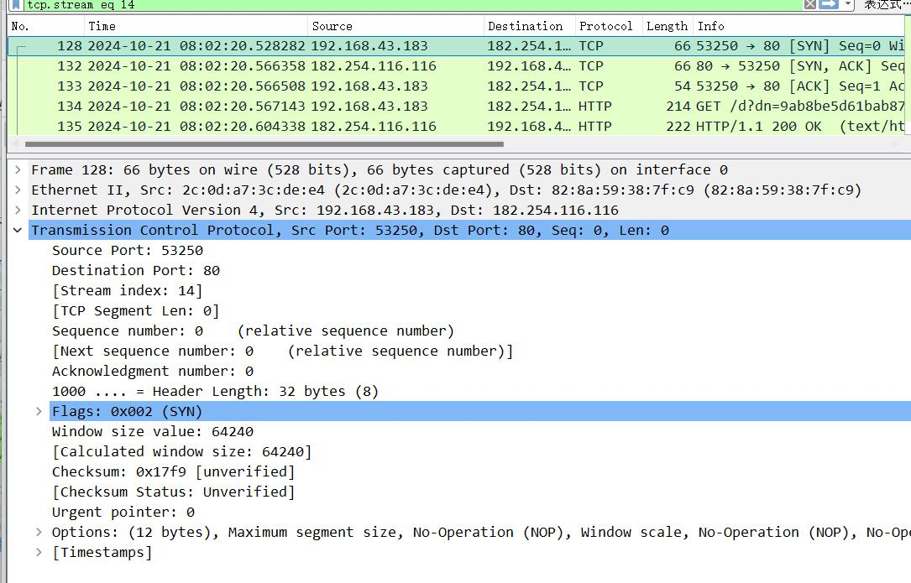
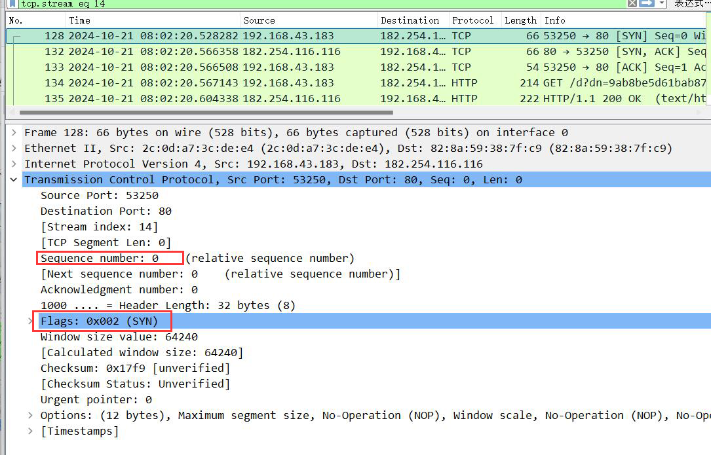
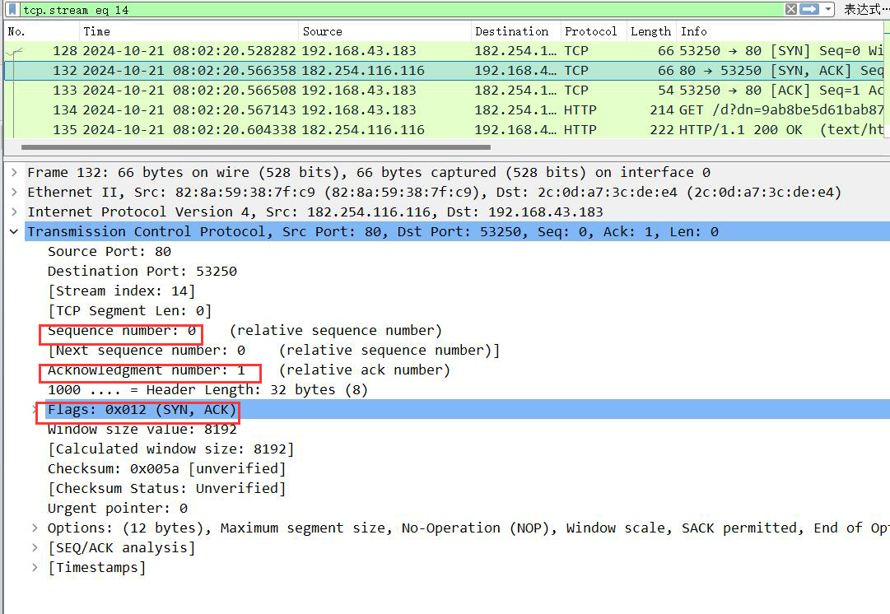

客户端发送一个TCP，标志位为SYN，序列号为0， 代表客户端请求建立连接。

服务器发回确认包, 标志位为 SYN,ACK. 将确认序号(Acknowledgement Number)设置为客户的I S N加1以.即0+1=1

客户端再次发送确认包(ACK) SYN标志位为0,ACK标志位为1.并且把服务器发来ACK的序号字段+1,放在确定字段中发送给对方.并且在数据段放写ISN的+1

**第一次握手（SYN）**: 客户端发送一个带有 `SYN` 标志位的数据包，表示请求建立连接。

**第二次握手（SYN-ACK）**: 服务器收到 `SYN` 后，返回一个带有 `SYN` 和 `ACK` 标志位的数据包，表示确认收到连接请求，并请求建立连接。

**第三次握手（ACK）**: 客户端收到服务器的 `SYN-ACK` 后，发送一个带有 `ACK` 标志位的数据包，确认连接建立。

# 实验一 TCP及UDP协议数据包分析实验

### 一、TCP 三次握手

Wireshark简单抓包：

打开wireshark, 打开浏览器输入访问的网址

在wireshark中输入http过滤， 然后选中GET / HTTP/1.1的那条记录，右键然后点击”Follow TCP Stream”，得到的结果如图

一次点击上面三个TCP：

**第一次握手（SYN）**: 客户端发送一个带有 `SYN` 标志位的数据包，表示请求建立连接。

**第二次握手（SYN-ACK）**: 服务器收到 `SYN` 后，返回一个带有 `SYN` 和 `ACK` 标志位的数据包，表示确认收到连接请求，并请求建立连接。

**第三次握手（ACK）**: 客户端收到服务器的 `SYN-ACK` 后，发送一个带有 `ACK` 标志位的数据包，确认连接建立。

### 二、UDP包

然后选择过滤Filter，并选择UDP。选取一个UDP数据包进行观察，并回答以下有关跟踪到的数据包#1的问题：

A、这个数据包的哪个域表明它是基于UDP通信的；

B、这个数据包的源端口和目的端口；

C、这个数据包的长度是多少？

D、这个数据包有多少字节的数据？

E、收到哪几种不同类型的UDP包

**A. 这个数据包的哪个域表明它是基于UDP通信的**

在 `Internet Protocol Version 4` 的详细信息中，字段 `Protocol: UDP (17)` 表明这是一个 UDP 协议数据包。协议号 17 代表 UDP。

**B. 这个数据包的源端口和目的端口**

- **源端口 (Src Port)**: 27030
- **目的端口 (Dst Port)**: 8016

**C. 这个数据包的长度是多少？**

- 在 `Internet Protocol Version 4` 的详细信息中，`Total Length: 67` 表明数据包的总长度为 67 字节（IP 包的总长度）。
- 同时，`Frame 19` 的信息显示这个帧在物理线路上传输了 **81 字节**（包括以太网帧的开销）。

**D. 这个数据包有多少字节的数据？**

- 在 `User Datagram Protocol` 的详细信息中，UDP 的数据部分为 39 字节，这由 `Data (39 bytes)` 字段明确表示。

**E. 收到哪几种不同类型的UDP包？**

要识别所有不同类型的 UDP 包，需要查看 Wireshark 捕获到的其他包并根据它们的源端口、目的端口或负载来进行分类。例如，你可能会看到 DNS、DHCP、SNMP 或 RTP 数据包。
